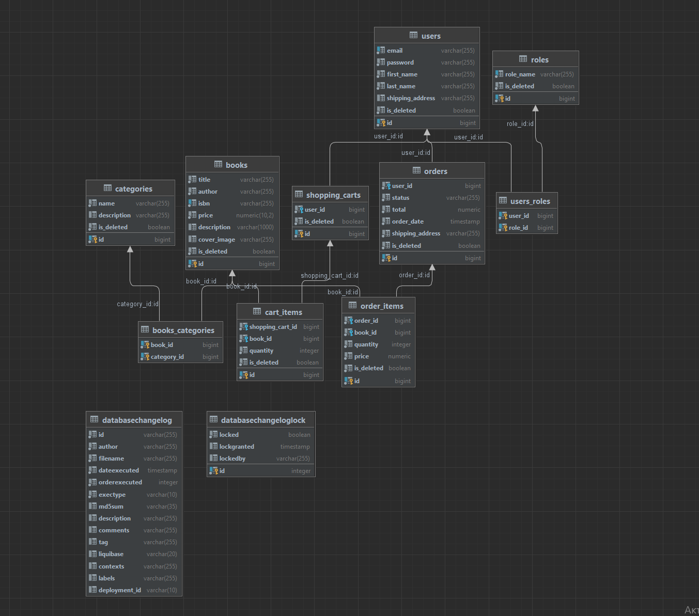

# 📚 Online Book Store project
____
## Description

Online Book Shop project is a comprehensive solution for managing user authentication, book management, category management, order placement, and shopping cart functionality. This project is designed to provide a seamless experience for both book enthusiasts and administrators.

## Technologies and Tools Used

In this project I used: **Spring Boot, Spring Security, Spring Web, Spring Data JPA, Hibernate, Swagger, Pagination, OpenAPI**.

## Diagram 

___

### Controllers

### 🙎‍♂️ Authentication Controller

#### Authentication

I use JWT (JSON Web Tokens) for authentication. To access protected endpoints, include the generated JWT token in the **Authorization:Bearer Token** in your request in Postman.

#### Login

- **Endpoint:** `/api/auth/login` (POST)
- **Accept:** UserLoginRequestDto
- **Return:** UserLoginResponseDto

#### Registration

- **Endpoint:** `/api/auth/register` (POST)
- **Accept:** UserRegistrationRequestDto
- **Return:** UserResponseDto

### 📘 Book Controller

#### Get All Books

- **Endpoint:** `/api/books` (GET)
- **Accept:** Pageable
- **Return:** List<BookDto>

#### Get Book by ID

- **Endpoint:** `/api/books/{id}` (GET)
- **Accept:** `id` (path)
- **Return:** BookDto

#### Create a New Book (for admin)

- **Endpoint:** `/api/books` (POST)
- **Accept:** CreateBookRequestDto
- **Return:** BookDto

#### Update a Book by ID (for admin)

- **Endpoint:** `/api/books/{id}` (PUT)
- **Accept:** `id` (path), BookDto
- **Return:** BookDto
- 
#### Delete a Book by ID (for admin)

- **Endpoint:** `/api/books/{id}` (DELETE)
- **Accept:** `id` (path)
- **Return:** Nothing

#### Search Books

- **Endpoint:** `/api/books/search` (GET)
- **Accept:** BookSearchParametersDto
- **Return:** List<BookDto>

### 📌 Category Controller

#### Get All Categories

- **Endpoint:** `/api/categories` (GET)
- **Accept:** Pageable
- **Return:** List<CategoryDto>

#### Get Category by ID

- **Endpoint:** `/api/categories/{id}` (GET)
- **Accept:** `id` (path) 
- **Return:** CategoryDto

#### Create a New Category (for admin)

- **Endpoint:** `/api/categories` (POST)
- **Accept:** CategoryDto
- **Return:** CategoryDto

#### Update a Category by ID (for admin)

- **Endpoint:** `/api/categories/{id}` (PUT)
- **Accept:** `id` (path), CategoryDto
- **Return:** CategoryDto

#### Delete a Category by ID (for admin)

- **Endpoint:** `/api/categories/{id}` (DELETE)
- **Accept:** `id` (path)
- **Return:** Nothing

#### Get Books by Category ID

- **Endpoint:** `/api/categories/{id}/books` (GET)
- **Accept:** `id` (path)
- **Return:** List<BookDtoWithoutCategoryIds>

### 📝 Order Controller

#### Get All Orders

- **Endpoint:** `/api/orders` (GET)
- **Accept:** Pageable
- **Return:** List<OrderDto

#### Get all Order Items by Order ID

- **Endpoint:** `/api/orders/{orderId}/items` (GET)
- **Accept:** `id` (path), Pageable
- **Return:** List<OrderItemResponseDto>

#### Get a Order Item by ID

- **Endpoint:** `/api/orders/{orderId}/items/{itemId}` (GET)
- **Accept:** `orderId`, `id` (path)
- **Return:** OrderItemResponseDto

#### Create a New Order 

- **Endpoint:** `/api/orders` (POST)
- **Accept:** OrderShippingAddressDto
- **Return:** OrderDto

#### Update Order Status (for admin)

- **Endpoint:** `/api/orders/{id}` (PATCH)
- **Parameters:** `id` (path), OrderStatusDto
- **Request Body:** OrderDto

### 💳 Shopping Cart Controller

#### Get Shopping Cart

- **Endpoint:** `/cart` (GET)
- **Accept:** Nothing
- **Return:** ShoppingCartDto

#### Add a Cart Item

- **Endpoint:** `/cart` (POST)
- **Accept:** CartItemRequestDto
- **Return:** CartItemDto

#### Update a Cart Item

- **Endpoint:** `/cart/cart-items/{cartItemId}` (PUT)
- **Accept:** `cartItemId` (path)
- **Return:** CartItemDto

#### Delete a Cart Item by ID

- **Endpoint:** `/cart/cart-items/{cartItemId}` (DELETE)
- **Accept:** `cartItemId` (path)
- **Return:** Nothing

## Setup and Usage

To set up and use this project, follow these steps:
1. Install Intellij IDEA Ultimate Edition on your computer.
2. Clone the repository on your computer.
3. Install Docker Desktop on your computer.
4. Write three commands in the terminal: `mvn clean package`, `docker-compose build` and `docker-compose up`.
5. Enter URL:`http://localhost:8088{endpoint}` in Postman. 

## Video
https://youtu.be/3xIB0mB3Rr4
